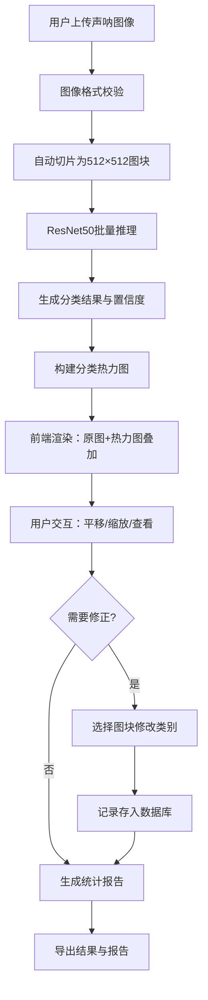

## 1. 产品概述

面向海洋地质调查单位的侧扫声呐图像智能分析系统，实现海底底质自动分类与可视化分析。系统支持超大分辨率声呐图像（最高20k×20k像素）的自动切片推理，输出泥沙/岩石/珊瑚/人工目标四分类结果，并提供热力图叠加、统计分析、人工修正等功能，显著提升海洋地质调查工作效率。

- 核心价值：将传统人工判读效率提升10倍以上，实现底质分类标准化、可追溯
- 目标用户：海洋地质调查人员、海洋环境监测人员、海底工程勘察人员

## 2. 核心功能

### 2.1 用户角色

| 角色 | 注册方式 | 核心权限 |
|------|----------|----------|
| 调查员 | 单位内部账号 | 上传图像、查看分析结果、导出报告 |
| 审核员 | 单位内部账号 | 人工修正分类结果、查看修改记录 |
| 管理员 | 系统管理员 | 用户管理、系统配置、模型更新 |

### 2.2 功能模块

1. **图像上传模块**：支持PNG/TIFF格式声呐图像上传，自动切片为512×512图块
2. **智能分类模块**：基于ResNet50的四分类（泥沙/岩石/珊瑚/人工目标）深度学习模型
3. **可视化展示模块**：原图查看、热力图叠加、平移缩放交互
4. **统计分析模块**：类别占比饼图、沿测线方向类别分布折线图
5. **人工修正模块**：单个图块分类结果修改，修改记录持久化存储
6. **导出报告模块**：分类结果导出、统计报表生成

### 2.3 页面详情

| 页面名称 | 模块名称 | 功能描述 |
|----------|----------|----------|
| 主分析页面 | 顶部工具栏 | 文件上传、导出报告、刷新操作 |
| 主分析页面 | 中央图像区 | 声呐原图展示、热力图叠加、平移/缩放交互、图块选择 |
| 主分析页面 | 右侧控制面板 | 分类图例、透明度滑块、类别隐藏开关、人工修正工具 |
| 主分析页面 | 底部统计区 | 类别占比饼图、沿测线分布折线图 |
| 历史记录页面 | 任务列表 | 历史分析任务查询、状态查看、结果回看 |
| 修正记录页面 | 记录列表 | 人工修正记录查询、审核追踪 |

## 3. 核心流程

用户上传声呐图像 → 系统自动切片为512×512图块 → 深度学习模型批量推理 → 生成分类结果与热力图 → 前端渲染展示（支持交互）→ 用户可人工修正单个图块 → 生成统计报告 → 导出分类结果

## 4. 用户界面设计

### 4.1 设计风格

- **主色调**：深海蓝 `#0A2463`，体现海洋科技感
- **辅助色**：科技青 `#3E92CC`、警示橙 `#F46036`、数据绿 `#1B998B`
- **类别色**：泥沙 `#D4A574`、岩石 `#6B7280`、珊瑚 `#E63946`、人工目标 `#FFD700`
- **字体**：显示字体使用 `JetBrains Mono`（科技感等宽字体），正文字体使用 `Noto Sans SC`
- **布局**：三栏式专业布局，顶部工具栏固定，中央图像区自适应，右侧面板悬浮，底部图表区可折叠
- **交互**：悬停微动画、平滑过渡、拖拽操作反馈

### 4.2 页面设计概述

| 页面名称 | 模块名称 | UI元素 |
|----------|----------|--------|
| 主分析页面 | 顶部工具栏 | 深色磨砂玻璃效果、圆角按钮、上传按钮带拖拽效果、导出下拉菜单 |
| 主分析页面 | 中央图像区 | 深色背景、原图与热力图双层Canvas、十字准星、比例尺、坐标显示 |
| 主分析页面 | 右侧控制面板 | 半透明卡片、类别色块图例、滑块控件、开关按钮、修正工具选择器 |
| 主分析页面 | 底部统计区 | 可折叠面板、ECharts图表、数据卡片、统计数值高亮 |

### 4.3 响应式

- 桌面端优先设计（≥1440px），三栏完整布局
- 平板端（1024px-1440px）：底部统计区自动折叠，右侧面板可收起
- 移动端（<1024px）：单列布局，面板切换为标签页模式
- 触摸操作优化：支持双指缩放、单指拖拽

### 4.4 交互体验

- 图像加载：骨架屏占位 + 渐进式加载
- 推理过程：进度条显示 + 已处理图块数量统计
- 图块选择：点击高亮 + 信息浮窗显示类别和置信度
- 热力图透明度：实时预览调整效果
- 人工修正：点击图块弹出类别选择器，确认后平滑过渡
