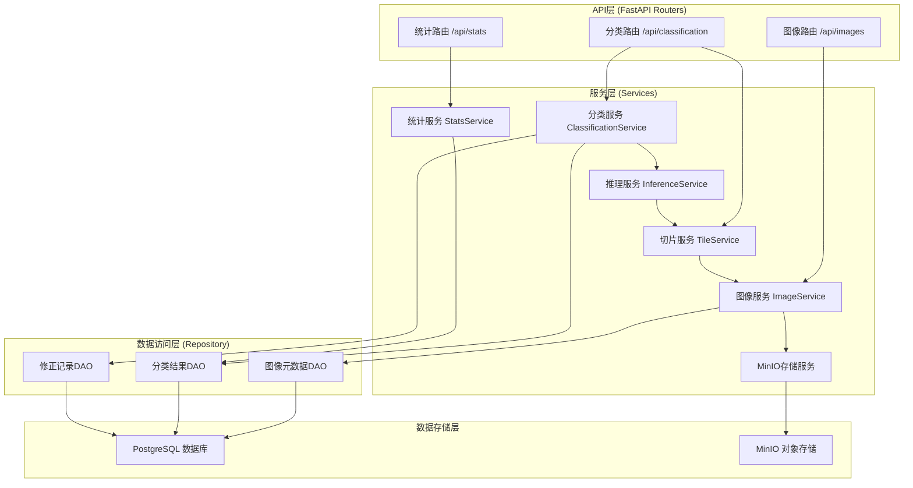
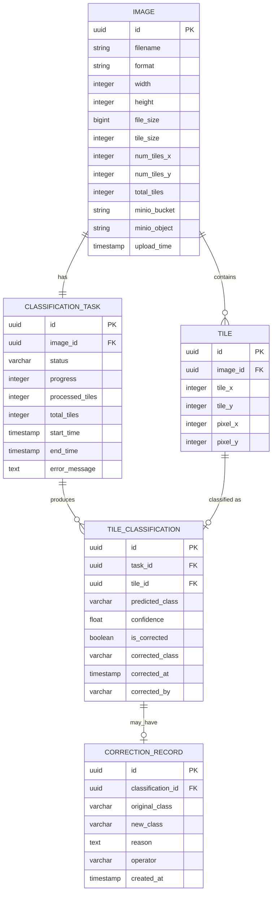

## 1. 架构设计


## 2. 技术描述

### 2.1 前端技术栈
- **框架**：Vue 3.4 + TypeScript 5.4 + Vite 5.2
- **UI组件库**：Element Plus 2.7
- **图表库**：ECharts 5.5
- **状态管理**：Pinia 2.1
- **路由**：Vue Router 4.3
- **图像处理**：OpenSeadragon 4.1（大图浏览）+ Canvas API（热力图渲染）
- **样式**：Tailwind CSS 3.4 + SCSS

### 2.2 后端技术栈
- **Web框架**：FastAPI 0.111 + Uvicorn 0.30
- **AI框架**：PyTorch 2.3 + torchvision 0.18
- **图像处理**：Pillow 10.3 + tifffile 2024.5 + OpenCV 4.9
- **数据库**：PostgreSQL 16 + SQLAlchemy 2.0 + psycopg2-binary 2.9
- **对象存储**：MinIO SDK 7.2
- **异步任务**：Celery 5.4 + Redis 7.2
- **数据校验**：Pydantic 2.7

### 2.3 部署架构
- **反向代理**：Nginx 1.26
- **容器化**：Docker 26 + Docker Compose 2.27
- **GPU加速**：CUDA 12.1 + cuDNN 8.9

## 3. 目录结构

```
├── frontend/                    # 前端项目
│   ├── src/
│   │   ├── components/          # 公共组件
│   │   │   ├── ImageViewer.vue  # 图像查看器（平移缩放）
│   │   │   ├── HeatmapLayer.vue # 热力图层
│   │   │   ├── ControlPanel.vue # 右侧控制面板
│   │   │   ├── StatsCharts.vue  # 统计图表
│   │   │   └── ToolBar.vue      # 顶部工具栏
│   │   ├── composables/         # 组合式函数
│   │   │   ├── useImageLoader.ts
│   │   │   ├── useClassification.ts
│   │   │   └── useHeatmap.ts
│   │   ├── stores/              # Pinia状态
│   │   │   ├── imageStore.ts
│   │   │   └── classificationStore.ts
│   │   ├── api/                 # API接口
│   │   │   ├── image.ts
│   │   │   └── classification.ts
│   │   ├── types/               # 类型定义
│   │   ├── utils/               # 工具函数
│   │   ├── pages/               # 页面组件
│   │   └── App.vue
│   └── package.json
│
├── backend/                     # 后端项目
│   ├── app/
│   │   ├── main.py              # FastAPI入口
│   │   ├── api/                 # API路由
│   │   │   ├── __init__.py
│   │   │   ├── image.py         # 图像上传/下载
│   │   │   ├── classification.py # 分类推理
│   │   │   └── stats.py         # 统计分析
│   │   ├── core/                # 核心配置
│   │   │   ├── config.py
│   │   │   └── database.py
│   │   ├── models/              # ORM模型
│   │   │   ├── image.py
│   │   │   ├── tile.py
│   │   │   └── correction.py
│   │   ├── schemas/             # Pydantic模式
│   │   │   ├── image.py
│   │   │   ├── classification.py
│   │   │   └── stats.py
│   │   ├── services/            # 业务逻辑
│   │   │   ├── image_service.py
│   │   │   ├── classification_service.py
│   │   │   ├── tile_service.py
│   │   │   └── minio_service.py
│   │   └── ml/                  # 机器学习模块
│   │       ├── model.py         # ResNet50模型定义
│   │       ├── dataset.py       # 数据集处理
│   │       └── inference.py     # 推理逻辑
│   ├── models/                  # 模型权重文件
│   ├── requirements.txt
│   └── Dockerfile
│
├── docker-compose.yml           # 容器编排
├── migrations/                  # 数据库迁移
│   └── 001_init_schema.sql
└── .env.example                 # 环境变量示例
```

## 4. 路由定义

### 4.1 前端路由

| 路由 | 页面 | 说明 |
|------|------|------|
| `/` | 主分析页 | 声呐图像上传、分析、可视化 |
| `/history` | 历史记录页 | 历史任务列表查询 |
| `/corrections` | 修正记录页 | 人工修正记录查询 |

### 4.2 后端API路由

| 方法 | 路径 | 说明 |
|------|------|------|
| POST | `/api/images/upload` | 上传声呐图像 |
| GET | `/api/images/{image_id}` | 获取图像元数据 |
| GET | `/api/images/{image_id}/tile/{z}/{x}/{y}` | 获取图像切片（用于DeepZoom） |
| GET | `/api/images/{image_id}/original` | 下载原始图像 |
| POST | `/api/classification/start` | 启动分类任务 |
| GET | `/api/classification/{task_id}/status` | 查询分类任务状态 |
| GET | `/api/classification/{task_id}/results` | 获取分类结果 |
| POST | `/api/classification/{task_id}/tile/{tile_id}/correct` | 人工修正图块分类 |
| GET | `/api/stats/{task_id}/summary` | 获取分类统计摘要 |
| GET | `/api/stats/{task_id}/profile` | 获取沿测线分布数据 |
| GET | `/api/history` | 获取历史任务列表 |
| GET | `/api/corrections` | 获取修正记录列表 |
| GET | `/api/export/{task_id}/report` | 导出分析报告 |

## 5. API 数据模型

```typescript
// 类别定义
enum SubstrateType {
  SEDIMENT = 'sediment',      // 泥沙
  ROCK = 'rock',              // 岩石
  CORAL = 'coral',            // 珊瑚
  MAN_MADE = 'man_made'       // 人工目标
}

// 图像元数据
interface ImageMetadata {
  id: string;
  filename: string;
  format: 'png' | 'tiff';
  width: number;
  height: number;
  fileSize: number;
  tileSize: number;
  numTilesX: number;
  numTilesY: number;
  totalTiles: number;
  uploadTime: string;
  minioBucket: string;
  minioObject: string;
}

// 图块分类结果
interface TileClassification {
  tileId: string;
  imageId: string;
  tileX: number;
  tileY: number;
  predictedClass: SubstrateType;
  confidence: number;
  isCorrected: boolean;
  correctedClass?: SubstrateType;
  correctedAt?: string;
  correctedBy?: string;
}

// 分类任务
interface ClassificationTask {
  id: string;
  imageId: string;
  status: 'pending' | 'processing' | 'completed' | 'failed';
  progress: number;
  processedTiles: number;
  totalTiles: number;
  startTime: string;
  endTime?: string;
  errorMessage?: string;
}

// 统计摘要
interface StatsSummary {
  taskId: string;
  totalTiles: number;
  classDistribution: Record<SubstrateType, {
    count: number;
    percentage: number;
    avgConfidence: number;
  }>;
}

// 沿测线分布数据
interface ProfileDataPoint {
  position: number;      // 沿测线位置（像素）
  sediment: number;      // 该位置泥沙占比
  rock: number;          // 该位置岩石占比
  coral: number;         // 该位置珊瑚占比
  man_made: number;      // 该位置人工目标占比
}

// 人工修正请求
interface CorrectionRequest {
  tileId: string;
  newClass: SubstrateType;
  reason?: string;
}
```

## 6. 服务架构图



## 7. 数据模型

### 7.1 ER图



### 7.2 DDL 语句

```sql
-- 扩展
CREATE EXTENSION IF NOT EXISTS "uuid-ossp";

-- 图像表
CREATE TABLE images (
    id UUID PRIMARY KEY DEFAULT uuid_generate_v4(),
    filename VARCHAR(255) NOT NULL,
    format VARCHAR(10) NOT NULL CHECK (format IN ('png', 'tiff')),
    width INTEGER NOT NULL,
    height INTEGER NOT NULL,
    file_size BIGINT NOT NULL,
    tile_size INTEGER NOT NULL DEFAULT 512,
    num_tiles_x INTEGER NOT NULL,
    num_tiles_y INTEGER NOT NULL,
    total_tiles INTEGER NOT NULL,
    minio_bucket VARCHAR(100) NOT NULL,
    minio_object VARCHAR(255) NOT NULL,
    upload_time TIMESTAMP NOT NULL DEFAULT CURRENT_TIMESTAMP
);

CREATE INDEX idx_images_upload_time ON images(upload_time DESC);

-- 图表表
CREATE TABLE tiles (
    id UUID PRIMARY KEY DEFAULT uuid_generate_v4(),
    image_id UUID NOT NULL REFERENCES images(id) ON DELETE CASCADE,
    tile_x INTEGER NOT NULL,
    tile_y INTEGER NOT NULL,
    pixel_x INTEGER NOT NULL,
    pixel_y INTEGER NOT NULL,
    UNIQUE(image_id, tile_x, tile_y)
);

CREATE INDEX idx_tiles_image_id ON tiles(image_id);

-- 分类任务表
CREATE TABLE classification_tasks (
    id UUID PRIMARY KEY DEFAULT uuid_generate_v4(),
    image_id UUID NOT NULL REFERENCES images(id) ON DELETE CASCADE,
    status VARCHAR(20) NOT NULL DEFAULT 'pending' 
        CHECK (status IN ('pending', 'processing', 'completed', 'failed')),
    progress INTEGER NOT NULL DEFAULT 0,
    processed_tiles INTEGER NOT NULL DEFAULT 0,
    total_tiles INTEGER NOT NULL,
    start_time TIMESTAMP NOT NULL DEFAULT CURRENT_TIMESTAMP,
    end_time TIMESTAMP,
    error_message TEXT
);

CREATE INDEX idx_tasks_status ON classification_tasks(status);
CREATE INDEX idx_tasks_image_id ON classification_tasks(image_id);

-- 图块分类结果表
CREATE TABLE tile_classifications (
    id UUID PRIMARY KEY DEFAULT uuid_generate_v4(),
    task_id UUID NOT NULL REFERENCES classification_tasks(id) ON DELETE CASCADE,
    tile_id UUID NOT NULL REFERENCES tiles(id) ON DELETE CASCADE,
    predicted_class VARCHAR(20) NOT NULL 
        CHECK (predicted_class IN ('sediment', 'rock', 'coral', 'man_made')),
    confidence FLOAT NOT NULL CHECK (confidence BETWEEN 0 AND 1),
    is_corrected BOOLEAN NOT NULL DEFAULT FALSE,
    corrected_class VARCHAR(20) 
        CHECK (corrected_class IN ('sediment', 'rock', 'coral', 'man_made')),
    corrected_at TIMESTAMP,
    corrected_by VARCHAR(100),
    UNIQUE(task_id, tile_id)
);

CREATE INDEX idx_classifications_task_id ON tile_classifications(task_id);
CREATE INDEX idx_classifications_tile_id ON tile_classifications(tile_id);
CREATE INDEX idx_classifications_class ON tile_classifications(predicted_class);

-- 修正记录表
CREATE TABLE correction_records (
    id UUID PRIMARY KEY DEFAULT uuid_generate_v4(),
    classification_id UUID NOT NULL REFERENCES tile_classifications(id) ON DELETE CASCADE,
    original_class VARCHAR(20) NOT NULL,
    new_class VARCHAR(20) NOT NULL,
    reason TEXT,
    operator VARCHAR(100) NOT NULL,
    created_at TIMESTAMP NOT NULL DEFAULT CURRENT_TIMESTAMP
);

CREATE INDEX idx_corrections_classification_id ON correction_records(classification_id);
CREATE INDEX idx_corrections_created_at ON correction_records(created_at DESC);
```

## 8. 核心算法与性能优化

### 8.1 图像切片算法
```python
def slice_image(image: np.ndarray, tile_size: int = 512, overlap: int = 0) -> List[Dict]:
    """
    将大图切片为指定大小的图块
    Args:
        image: 原始图像数组 (H, W, C)
        tile_size: 图块大小，默认512
        overlap: 重叠像素，默认0
    Returns:
        图块列表，每个包含tile数据和坐标信息
    """
    h, w = image.shape[:2]
    tiles = []
    stride = tile_size - overlap
    
    for y in range(0, h, stride):
        for x in range(0, w, stride):
            # 计算实际截取区域（处理边界）
            y_end = min(y + tile_size, h)
            x_end = min(x + tile_size, w)
            tile = image[y:y_end, x:x_end]
            
            # 边界图块填充至tile_size
            if tile.shape[0] < tile_size or tile.shape[1] < tile_size:
                padded = np.zeros((tile_size, tile_size, image.shape[2]), dtype=image.dtype)
                padded[:tile.shape[0], :tile.shape[1]] = tile
                tile = padded
            
            tiles.append({
                'tile': tile,
                'tile_x': x // stride,
                'tile_y': y // stride,
                'pixel_x': x,
                'pixel_y': y
            })
    return tiles
```

### 8.2 批量推理优化
```python
# 推理配置
BATCH_SIZE = 32  # T4 GPU可处理的批次大小
NUM_WORKERS = 4  # 数据加载线程数
PRECISION = 'fp16'  # 半精度推理加速

# 性能目标：20k×20k图像 ≈ 1600个图块，目标<2分钟
# 单批次推理时间 ≈ 150ms，1600/32 = 50批次
# 总推理时间 ≈ 50 × 0.15s = 7.5s（不含数据加载和后处理）
```

### 8.3 前端渲染优化
- 使用WebGL加速的Canvas渲染热力图
- 采用OpenSeadragon实现DeepZoom切片浏览，支持无限缩放
- 热力图使用Canvas分层渲染，原图与热力图分离
- 图块按需加载，仅渲染视口内的图块
- 使用requestAnimationFrame保证帧率>30fps
